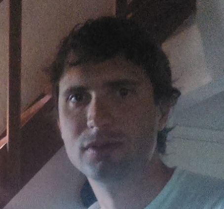

## About Me

Hi! I'm a software developer from Argentina.

## Interests

I'm interested in programming languages. I believe in [language oriented programming](https://en.wikipedia.org/wiki/Language-oriented_programming), that is, 
> creating an implementation language as isomorphic as possible to the user's descriptions, so that the mapping between requirements and implementation is as direct as possible. [Read more](/interests).

## Open source libraries and projects

I've developed several Open Source libraries, most of them in Smalltalk and Common Lisp, my [favourite programming languages](/favouriteProgrammingLanguages).

Here I list the most relevant:

* [Djula](https://github.com/mmontone/djula). Djula is a port of Python's Django template engine to Common Lisp.

See the full list [here](/software)
